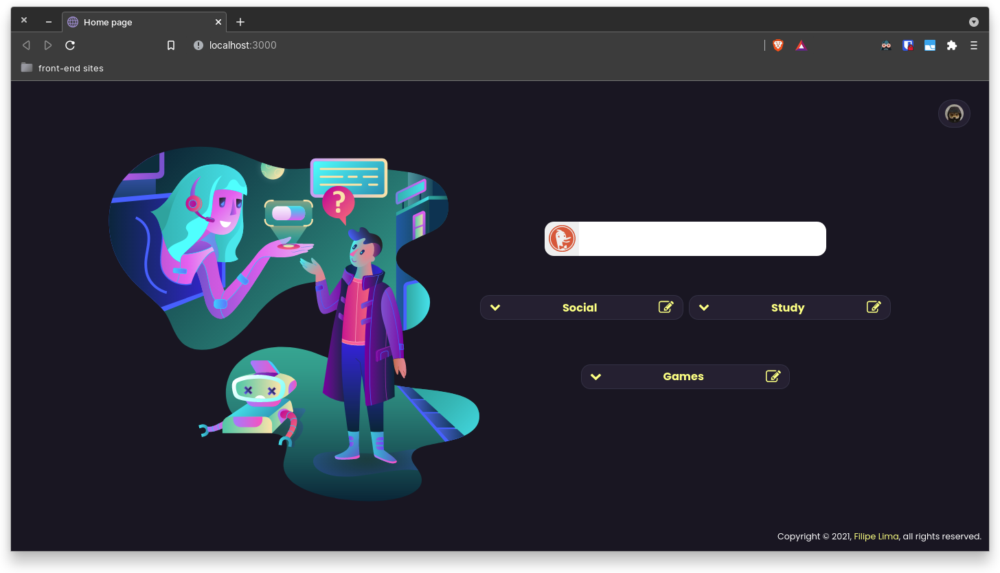

<h1 align="center">
Better Home Page
</h1>

Deployed <a href="https://browser-home.vercel.app/">here</a>.

  
  

<h2 align="center">Screenshot</h2>

  

## Description

A Home Page that allow the user to save a list of links in three customizable menus, you can choose the name of menus and name of item that will redirect you to the desired link when you want. Also counts with a search input that will redirect you to a search page in DuckDuckGo search engine.

## Techs

- [x] Next.js
- [x] React.js
- [x] Firebase
- [x] TypeScript
- [x] Styled-Components

## Usage

1. Run `npm install` or `yarn install`. 
2. Run `yarn dev` and access `http://localhost:3000`. 
